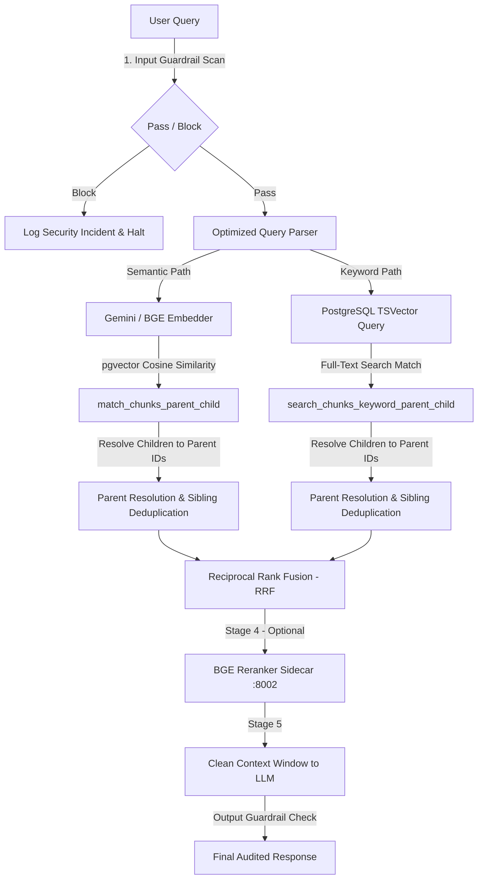

# AegisRAG

[](https://opensource.org/licenses/MIT)
[](https://nextjs.org/)
[](https://www.typescriptlang.org/)
[](https://supabase.com/)
[](https://github.com/pgvector/pgvector)
[](https://ai.google.dev/)

> **AegisRAG** is a production-grade, enterprise compliance RAG (Retrieval-Augmented Generation) platform built to ingest, audit, and intelligently query thousands of pages of complex security and compliance policy frameworks — such as **NIST SP 800-53**, **NIST CSF 2.0**, **GDPR**, **SOC 2**, **HIPAA**, and **OWASP Top 10**.

---

## Table of Contents

1. [What Is AegisRAG?](#what-is-aegisrag)
2. [Problem Statement](#problem-statement)
3. [Key Features](#key-features)
4. [System Architecture](#system-architecture)
5. [5-Stage Retrieval Pipeline](#5-stage-retrieval-pipeline)
6. [Security & Multi-Tenant Design](#security--multi-tenant-design)
7. [Application Screens](#application-screens)
8. [Technology Stack](#technology-stack)
9. [Prerequisites](#prerequisites)
10. [Installation & Setup](#installation--setup)
11. [Environment Variables Reference](#environment-variables-reference)
12. [Running the BGE Sidecar (Optional)](#running-the-bge-sidecar-optional)
13. [Database Migrations](#database-migrations)
14. [Project Structure](#project-structure)
15. [Future Roadmap](#future-roadmap)
16. [Contributing](#contributing)
17. [License](#license)

---

## What Is AegisRAG?

AegisRAG is a full-stack web application that replaces manual compliance document review with an AI-powered, security-hardened question-answering system. Instead of downloading and manually reading through hundreds of pages of compliance PDFs, you upload them to AegisRAG and ask questions in plain English.

**Example use cases:**
- *"What are the access control requirements in NIST SP 800-53 for privileged accounts?"*
- *"Does our current policy cover all GDPR Article 32 technical safeguards?"*
- *"Summarize the incident response requirements across NIST and SOC 2."*

AegisRAG retrieves the exact relevant sections, cites them, and generates a grounded answer — with guardrails to prevent hallucination and prompt injection.

---

## Problem Statement

Standard RAG (Retrieval-Augmented Generation) pipelines fail in enterprise compliance environments due to four critical problems:

| Problem | Description |
|:--------|:------------|
| **Context Boundary Dilution** | Fixed-size chunking (e.g., 500-token blocks) splits sentences mid-thought, losing surrounding legal or technical context for the LLM. |
| **Hybrid Search Gaps** | Keyword-only search misses semantic meaning. Vector-only search misses exact alphanumeric codes like `AC-2(1)` or `CC6.1`. |
| **Data Leakage Risk** | Without database-enforced multi-tenant isolation, documents from one organization can leak to another. |
| **Prompt Injection & Jailbreaks** | Malicious prompts can hijack the system prompt, potentially exposing internal configurations or bypassing security controls. |

**AegisRAG solves all four** using a Parent-Child vector hierarchy, pgvector Row-Level Security (RLS), a 5-stage hybrid retrieval pipeline, and dual-layer guardrails.

---

## Key Features

- **Hybrid Search** — Combines semantic vector search (pgvector cosine similarity) with PostgreSQL full-text keyword search (TSVector), merged via Reciprocal Rank Fusion (RRF)
- **Parent-Child Retrieval** — Child chunks (256 tokens) are indexed for precise search; parent chunks (1024 tokens) are returned to the LLM for rich context
- **Neural Reranking** — Optional local BGE Reranker sidecar scores candidates against the query for maximum relevance before LLM context injection
- **Dual-Layer Guardrails** — Input guardrail blocks prompt injection; output guardrail redacts PII and validates citations before rendering
- **Database-Level Multi-Tenancy** — PostgreSQL Row-Level Security (RLS) enforces org isolation at the engine, not the application layer
- **Sensitivity Clearance Gates** — Filter document results dynamically by user clearance level (Public / Internal / Confidential / Restricted)
- **RAG Evaluation Suite** — Automated benchmarking panel measuring Faithfulness, Answer Relevance, and Context Recall
- **Compliance PDF Reports** — One-click PDF export of full audit reports with citations, risk scores, and remediation steps
- **Embedding Provider Abstraction** — Swap between Google Gemini embeddings and a local BGE FastAPI sidecar without code changes

---

## System Architecture

AegisRAG is built on **Next.js 16 App Router** integrated with **Supabase (PostgreSQL + pgvector)**. The query lifecycle coordinates five stages of retrieval before generating a response:



---

## 5-Stage Retrieval Pipeline

### Stage 1 & 2 — Parent-Child Vector Retrieval

Documents are split into two levels during ingestion:

- **Child Chunks** (~256 tokens): Dense, focused semantic fragments. Only these are embedded and stored in the vector index.
- **Parent Chunks** (~1024 tokens): The surrounding full context block. These are never embedded — they are only fetched after child retrieval.

When you query, the database retrieves the best matching child vectors, maps their `parent_id` references, and returns the full parent text to the LLM. This prevents context boundary dilution.

### Stage 3 — Sibling Deduplication

Multiple child chunks can map to the same parent. A score-sensitive reduction collapses these duplicates, keeping only the highest-scoring representative:

```typescript
function deduplicateByParent(results: SearchResult[]): SearchResult[] {
  const best = new Map<string, SearchResult>()
  for (const result of results) {
    const existing = best.get(result.chunkId)
    if (!existing || result.score > existing.score) {
      best.set(result.chunkId, result)
    }
  }
  return Array.from(best.values()).sort((a, b) => b.score - a.score)
}
```

### Stage 3 — Reciprocal Rank Fusion (RRF)

Vector search and full-text keyword search candidates are merged using the RRF algorithm, which is mathematically robust to score scale differences:

$$\text{RRF Score}(d) = \sum_{m \in M} \frac{1}{k + r_m(d)}$$

where $k = 60$ (smoothing constant) and $r_m(d)$ is document $d$'s rank position in retrieval mode $m$.

### Stage 4 — BGE Neural Reranker (Optional)

The top merged candidates are passed to a local Python FastAPI sidecar running `BAAI/bge-reranker-base`. It scores each `(query, chunk)` pair using a cross-encoder model and returns a ranked list. This dramatically reduces LLM context pollution.

### Stage 5 — LLM Generation with Guardrailed Output

The final cleaned context window is sent to **Google Gemini** (`gemini-2.0-flash`). The output guardrail then scans the response for PII, hallucination drift, and citation accuracy before it is rendered to the user.

---

## Security & Multi-Tenant Design

### Row-Level Security (RLS)

All data access is enforced at the PostgreSQL engine level. Every query is automatically scoped to the authenticated user's organization:

```sql
CREATE POLICY "embeddings_select_org_members"
  ON embeddings FOR SELECT
  USING (
    org_id = (SELECT org_id FROM user_profiles WHERE id = auth.uid())
  );
```

Even if an application bug misconstructs a query, the database will refuse to return data outside the user's org boundary.

### Sensitivity Clearance Gates

Document segments are tagged with a `sensitivity_level`. Retrieval queries dynamically apply clearance filters:

| Level | Access |
|:------|:-------|
| `public` | Any authenticated user |
| `internal` | Org members only |
| `confidential` | Users with Confidential clearance |
| `restricted` | Admin / CISO clearance only |

### Dual-Layer Guardrails

| Layer | What It Checks |
|:------|:---------------|
| **Input** | Prompt injection patterns, jailbreak attempts, system instruction overrides |
| **Output** | PII redaction, hallucination drift detection, citation source validation |

---

## Application Screens

| Screen | Description |
|:-------|:------------|
| **Command Hub** | Animated SVG particle node mesh showing retrieval health, security threat metrics, and operational controls |
| **Knowledge Workbench** | Live query interface with hybrid search path inspection, RRF rank visualization, and citation viewer |
| **Knowledge Vault** | Document upload pipeline showing ingestion status, chunk counts, and parent-child split previews |
| **Security Center** | SOC-style dashboard with prompt injection timelines, compliance alerts, and one-click threat remediation |
| **Compliance Studio** | Automated policy gap analysis across multiple frameworks with signed PDF audit export |
| **RAG Evaluation Panel** | Benchmarking suite measuring Faithfulness, Answer Relevance, and Context Recall against golden datasets |
| **Diagnostics Cockpit** | Real-time system health monitor for embedding providers, reranker sidecar, and database connections |

---

## Technology Stack

| Layer | Technology | Version | Purpose |
|:------|:-----------|:--------|:--------|
| **Framework** | Next.js (App Router) | 16.x | Core application, React 19 Server Components |
| **Language** | TypeScript | 5.x | Type-safe codebase |
| **Database** | Supabase (PostgreSQL) | Latest | Auth, data persistence, RLS enforcement |
| **Vector Engine** | pgvector | Latest | Cosine similarity vector search with RLS |
| **LLM Provider** | Google Gemini | `gemini-2.0-flash` | Primary generation model via `@google/genai` SDK |
| **Embeddings** | Google Gemini / BGE | Configurable | Dual-provider embedding abstraction |
| **Reranker** | BGE Reranker | `bge-reranker-base` | Local Python FastAPI neural reranker sidecar |
| **Styling** | TailwindCSS v4 | 4.x | Cinematic dark-mode design system |
| **Animations** | Framer Motion | 12.x | Micro-animations and page transitions |
| **Charts** | Recharts | 3.x | Real-time metrics and benchmark visualization |
| **Email** | Resend | Latest | Compliance notification emails |
| **Forms** | React Hook Form + Zod | Latest | Validated form handling |
| **State** | Zustand + TanStack Query | Latest | Client state and server data caching |
| **PDF Export** | jsPDF | Latest | Downloadable audit report generation |

---

## Prerequisites

Before you begin, make sure you have the following installed and configured:

| Requirement | Minimum Version | Notes |
|:------------|:----------------|:------|
| **Node.js** | v18.0.0+ | Required for Next.js |
| **npm** | v9.0.0+ | Comes with Node.js |
| **Git** | Any | For cloning the repo |
| **Supabase Account** | — | Free tier is sufficient. Create at [supabase.com](https://supabase.com) |
| **Google AI Studio Account** | — | Get a free Gemini API key at [aistudio.google.com](https://aistudio.google.com/app/apikey) |
| **Python 3.9+** *(Optional)* | 3.9+ | Only needed if running the local BGE reranker sidecar |

---

## Installation & Setup

### Step 1 — Clone the Repository

```bash
git clone https://github.com/HithaishiSP2004/AegisRag.git
cd AegisRag
```

### Step 2 — Install Node.js Dependencies

```bash
npm install
```

### Step 3 — Configure Environment Variables

Copy the example environment file and fill in your credentials:

```bash
cp .env.example .env.local
```

Open `.env.local` in a text editor and fill in all the required values. See the [Environment Variables Reference](#environment-variables-reference) section below for details on each variable.

> **Important:** Never commit `.env.local` to Git. It is already listed in `.gitignore` to prevent this.

### Step 4 — Set Up Your Supabase Project

1. Go to [app.supabase.com](https://app.supabase.com) and create a new project.
2. Go to **Project Settings → Database → Extensions** and enable **pgvector**.
3. Copy your **Project URL**, **Anon Key**, and **Service Role Key** from **Project Settings → API** into `.env.local`.

### Step 5 — Apply Database Migrations

Make sure you have the [Supabase CLI](https://supabase.com/docs/guides/cli) installed, then run:

```bash
supabase login
supabase link --project-ref YOUR_PROJECT_REF
supabase db push
```

This applies all migration files in `supabase/migrations/` to create the tables, RLS policies, vector indexes, and database functions.

### Step 6 — Run the Development Server

```bash
npm run dev
```

Open [http://localhost:3000](http://localhost:3000) in your browser. You should see the AegisRAG login screen.

### Step 7 — Create Your First Account

Register a new account via the signup page. The first user in an organization automatically receives admin clearance.

---

## Environment Variables Reference

Create a `.env.local` file based on `.env.example`. Here is a description of every variable:

### Supabase (Required)

| Variable | Description | Where to Find |
|:---------|:------------|:--------------|
| `NEXT_PUBLIC_SUPABASE_URL` | Your Supabase project's API URL | Supabase Dashboard → Project Settings → API |
| `NEXT_PUBLIC_SUPABASE_ANON_KEY` | Public anonymous client key | Supabase Dashboard → Project Settings → API |
| `SUPABASE_SERVICE_ROLE_KEY` | Admin service role key — keep this secret, server-side only | Supabase Dashboard → Project Settings → API |

### Google Gemini (Required)

| Variable | Description | Where to Find |
|:---------|:------------|:--------------|
| `GEMINI_API_KEY` | Primary Google Gemini API key | [aistudio.google.com/app/apikey](https://aistudio.google.com/app/apikey) |
| `GEMINI_API_KEY_2` | Optional fallback key when primary is rate-limited | Same as above |

### Cohere Reranker (Optional)

| Variable | Description |
|:---------|:------------|
| `COHERE_API_KEY` | Cohere API key for cloud-based reranking. Leave blank if using the local BGE sidecar. |

### Email (Optional)

| Variable | Description | Where to Find |
|:---------|:------------|:--------------|
| `RESEND_API_KEY` | API key for sending compliance notification emails | [resend.com/api-keys](https://resend.com/api-keys) |

### App Configuration

| Variable | Default | Description |
|:---------|:--------|:------------|
| `NEXT_PUBLIC_APP_URL` | `http://localhost:3000` | The base URL of your deployed application |
| `NEXT_PUBLIC_APP_NAME` | `AegisRAG` | Display name shown in the UI and emails |

### Feature Flags

| Variable | Default | Description |
|:---------|:--------|:------------|
| `NEXT_PUBLIC_DEMO_MODE` | `true` | Enables pre-seeded demo data. Set to `false` in production. |
| `NEXT_PUBLIC_ENABLE_3D` | `false` | Enables the interactive 3D logo component. |

### Embedding Provider

| Variable | Default | Description |
|:---------|:--------|:------------|
| `EMBEDDING_PROVIDER` | `gemini` | Set to `gemini` to use Google Gemini embeddings, or `bge` to use the local FastAPI sidecar. |
| `BGE_EMBEDDING_URL` | `http://localhost:8001/embed` | URL of the local BGE embedding FastAPI sidecar. |
| `BGE_MODEL_NAME` | `BAAI/bge-base-en-v1.5` | The HuggingFace model name for the BGE embedder. |
| `BGE_BATCH_SIZE` | `64` | Number of chunks to embed per batch. |

### Reranker

| Variable | Default | Description |
|:---------|:--------|:------------|
| `RERANKER_PROVIDER` | *(unset)* | Set to `bge` to enable the local neural reranker sidecar. |
| `BGE_RERANKER_URL` | `http://localhost:8002/rerank` | URL of the local BGE reranker FastAPI sidecar. |

### Retrieval Config

| Variable | Default | Description |
|:---------|:--------|:------------|
| `ENABLE_PARENT_CHILD_RETRIEVAL` | `false` | Toggles the Parent-Child retrieval strategy. Set to `true` to enable. |
| `ENABLE_RETRIEVAL_EVALS` | *(unset)* | Set to `true` to enable logging of retrieval evaluation metrics. |

---

## Running the BGE Sidecar (Optional)

AegisRAG optionally uses a local Python FastAPI sidecar for **neural reranking** and/or **local embeddings**. This is entirely optional — the default setup uses Google Gemini.

### Embedding Sidecar (Port 8001)

```bash
cd src/features/embeddings/providers
pip install -r requirements.txt
uvicorn app:app --host 0.0.0.0 --port 8001
```

Set `EMBEDDING_PROVIDER=bge` and `BGE_EMBEDDING_URL=http://localhost:8001/embed` in `.env.local`.

### Reranker Sidecar (Port 8002)

```bash
cd src/features/retrieval/reranker
pip install -r requirements.txt
uvicorn app:app --host 0.0.0.0 --port 8002
```

Set `RERANKER_PROVIDER=bge` and `BGE_RERANKER_URL=http://localhost:8002/rerank` in `.env.local`.

> **Note:** First-time startup will download the model weights from HuggingFace (~270 MB). Subsequent startups are fast.

---

## Database Migrations

All Supabase migrations are in the `supabase/migrations/` directory. They are applied in order and cover:

| Migration Range | What It Creates |
|:----------------|:----------------|
| `0001` – `0020` | Core tables: `user_profiles`, `documents`, `chunks`, `embeddings`, `conversations` |
| `0021` – `0040` | RLS policies, org-isolation, sensitivity clearance gates |
| `0041` – `0042` | Keyword FTS indexes, hybrid search SQL functions |
| `0043` – `0045` | Embedding cache tables and multi-provider readiness |
| `0046` – `0050` | Benchmark runs, RAG evaluation tables, reranker telemetry |
| `0051` | Parent-child retrieval functions (`match_chunks_parent_child`, `search_chunks_keyword_parent_child`) |

To apply all migrations:

```bash
supabase db push
```

---

## Project Structure

```
AegisRag/
├── .env.example                   # Template for environment variables (safe to commit)
├── .gitignore                     # Excludes .env.local, node_modules, corpus/, etc.
├── supabase/
│   └── migrations/                # SQL migration files for database setup
├── public/
│   ├── logo.png                   # App logo
│   └── logo-with-name.png         # Branded logo for PDF exports
└── src/
    ├── app/
    │   ├── (auth)/                # Login, Signup pages
    │   ├── (hub)/
    │   │   └── command-hub/       # Main animated dashboard
    │   ├── (app)/
    │   │   ├── knowledge-vault/   # Document upload & management
    │   │   ├── workflows/         # Compliance audit workflows
    │   │   └── dashboard/         # Evaluation & diagnostics
    │   └── api/                   # Next.js API route handlers
    ├── features/
    │   ├── chat/                  # Query interface & conversation management
    │   ├── documents/             # Document ingestion & processing
    │   ├── embeddings/            # Embedding provider abstraction (Gemini / BGE)
    │   ├── evaluation/            # RAG benchmark suite
    │   ├── guardrails/            # Input & output guardrail engines
    │   ├── pipeline/              # Ingestion pipeline & parent-child chunker
    │   ├── prompts/               # LLM prompt registry & manager
    │   ├── retrieval/             # Hybrid search, RRF, reranker, benchmark
    │   ├── security/              # Compliance dashboard & PDF report generation
    │   └── workflows/             # Compliance workflow engine
    ├── components/
    │   ├── layout/                # AppShell, Sidebar, GlobalIntelligenceBar
    │   └── ui/                    # Reusable UI components
    ├── config/                    # AI model config, Supabase clients
    ├── lib/                       # Shared utilities
    └── types/                     # TypeScript type definitions & DB schema types
```

---

## Future Roadmap

- [ ] **Multi-Vector Index Tuning** — Dynamic HNSW parameters (`m`, `ef_construction`) for large-scale deployments (500k+ chunks)
- [ ] **AI-Powered Crosswalk Mapping** — Auto-map controls across frameworks (e.g., SOC 2 CC6.1 to NIST AC-2)
- [ ] **Virus-Scanning Storage Hook** — ClamAV integration to scan uploaded PDFs for malware during ingestion
- [ ] **Local LLM Offline Gateway** — Ollama / LlamaCpp support for air-gapped government networks
- [ ] **Continuous Evaluation Cron** — Scheduled weekly benchmark runs to monitor RAG quality drift
- [ ] **SAML / SSO Integration** — Enterprise single-sign-on support via Supabase Auth providers

---

## Contributing

Contributions are welcome. To contribute:

1. Fork the repository
2. Create a feature branch: `git checkout -b feat/my-new-feature`
3. Commit your changes: `git commit -m 'feat: add my new feature'`
4. Push your branch: `git push origin feat/my-new-feature`
5. Open a Pull Request

Before opening a PR, please ensure:
- `npm run type-check` passes with no TypeScript errors
- `npm run format:check` passes with no formatting issues
- `.env.local` is **not** included in your commit

---

## License

AegisRAG is released under the [MIT License](LICENSE).

---

<div align="center">
  <p>Built for enterprise compliance teams who deserve better tooling.</p>
</div>
